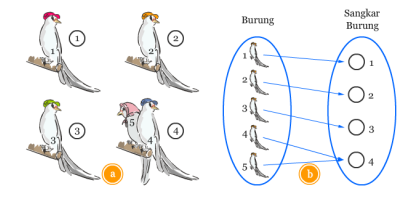

# MULTIPLE TRAVELING SALESMAN MENGGUNAKAN K-MEANS CLUSTERING DAN ANT COLONY OPTIMIZATION DENGAN VISUALISASI PADA PETA

## Preview


## Anggota Kelompok

1. Erki Kadhafi Rosyid (05111940000050)
2. I Kadek Agus Ariesta Putra (05111940000105)
3. Putu Ananda Satria Adi (05111940000113)

## Solusi

1. Konsep menentukan **stoping criteria** untuk **K-Means Clustering**
    
    Langkah pertama adalah menentukan pembagian M *waypoint* kepada N banyaknya sales dengan menerapkan prinsip sangkar burung (*pigeonhole principle*) yang menyatakan bahwa jika
    𝑛 burung terbang menuju 𝑚 sangkar dan 𝑛 > 𝑚, maka paling sedikit ada satu sangkar yang memuat dua atau lebih burung.
    
    
    
    Dengan demikian kita hanya perlu memastikan berapa nilai minimum dan maximum dari waypoint yang diterima sales setiap iterasi. Apabila selisih nilai minimum dan maximum tersebut kurang dari sama dengan 1, maka prinsip sangkar burung telah terpenuhi. Sehingga tidak memakan waktu tambahan untuk iterasi berikutnya.
    
2. Alur algoritma K-means clustering dalam bahasa javascript
    1. Menentukan variabel global sebagai berikut:
        
        ```jsx
        // Maximal iterasi
        let THIS_maxit = Number(prompt("CLUSTER :: MAX ITERATION?", _default="3"));
        
        // Posisi sales disimpan ke dalam array baru agar dapat berpindah
        let SALES_CENTROID = [];
        
        // Untuk menghitung jarak setiap sales ke setiap waypoint
        let distance_to_sales = [];
        
        // Untuk menyimpan data sebuah waypoint terdekat ke sales mana
        let nearest_to_sales = [];
        
        // Sebagai penanda apakah prinsip pigeon hole telah dipenuhi/tidak
        let PIGEONHOLE_FLAG = false;
        ```
        
    2. Menyiapkan variabel SALES_CENTROID dengan isi:
        1. key : id dari sales
        2. lon : koordinat longitude
        3. lat : koordinat langitude
        
        ```jsx
        Sales_List.forEach(function (item, key){
        		SALES_CENTROID.push({
        			key: key,
        			lon: item.home[0],
        			lat: item.home[1]
        		});
        	});
        ```
        
    3. Menyiapkan variabel distance_to_sales sebagai array 2 dimensi:
        
        ```jsx
        for(let j=0; j<SALES_CENTROID.length; j++){
        		distance_to_sales.push();
        		distance_to_sales[j] = [];
        		WayPoint_List.forEach(function (wp_item, wp_key){
        			distance_to_sales[j].push();
        		});
        	}
        ```
        
    4. Menyiapkan variabel nearest_to_sales dengan isi
        1. sales_id : sales terdekat
        2. distance : jarak ke sales tersebut ( default: 99999)
    5. Melakukan iterasi, dan untuk setiap iterasi
        1. Menghitung jarak suatu waypoint ke setiap sales lalu disimpan ke variabel distance_to_sales.
        2. Menentukan sebuah waypoint terdekat ke sales yang mana
        3. Menghitung nilai koordinat terbaru untuk setiap sales dengan formula:
            
            Nilai lon : rata-rata jumlah semua nilai lon dari waypoint terdekat
            
            Nilai lat : rata-rata jumlah semua nilai lat dari waypoint terdekat
            
        4. Dan juga dilakukan pengecekan untuk prinsip pigeon hole apakah sudah terpenuhi? dengan cara menghitung selisih total waypoint yang diperoleh setiap sales.
        5. Apabila belum memenuhi prinsip pigeon hole, maka iterasi tetap dilakukan
    
3. Setelah cluster diperoleh maka untuk setiap sales dengan pembagian waypoint yang diperoleh akan diteruskan dengan algoritma **Ant Colony Optimization**. Untuk algoritmanya sama seperti tugas minggu sebelumnya. Namun terdapat modifikasi untuk melakukan animasi visualisasi setiap langkah-langkahnya. Visualisasi berupa penggambaran jalur/rute yang terpilih

Untuk demo dapat dilihat langsung pada halaman : [http://kk.ariesta.club/](http://kk.ariesta.club/).
